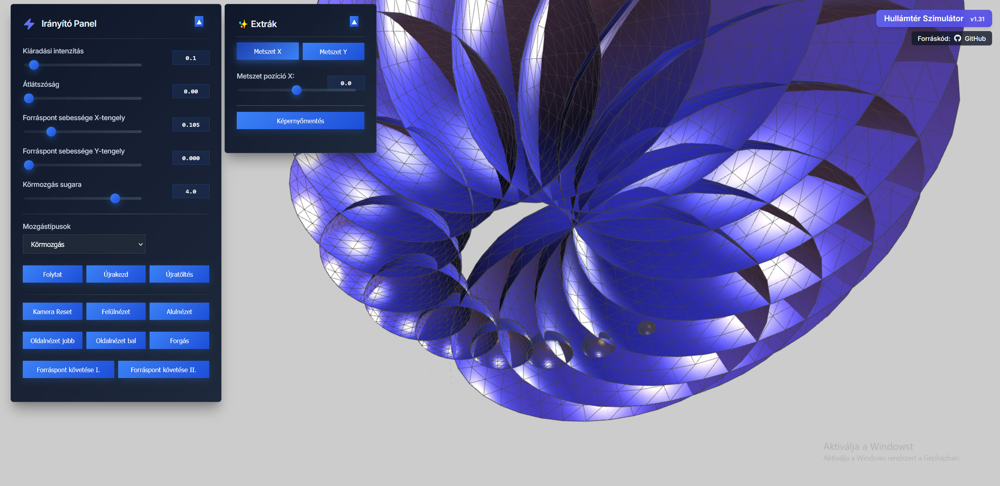

# 3D Hullámtér Szimulátor

## Újdonságok az 1.37-es verzióban (az 1.36-os verzióhoz képest)

**Irányító panel átalakítása oldalpanellé**:
- Ütközés modell finomítása
- Az Irányító panel mostantól a képernyő bal oldalán helyezkedik el teljes magasságban, oldalpanelként.
- Ki-be görgethető a panel tetején található nyíl gombbal (◀/▶).
- Az EXTRÁK panel tartalma bekerült az Irányító panel aljára, külön szekcióként.
- Ha a panel tartalma hosszabb mint a képernyő magassága, görgetni lehet a panelt.
- Egyedi scrollbar stílus a panelhez.
- A panel állapota (nyitott/zárt) megőrződik az oldal frissítésekor.

## Újdonságok az 1.36-os verzióban (az 1.35-es verzióhoz képest)

**Időszál vonal leképzése**:

- Az időszál vonal leképzése most már elérhető a "Időszál megjelenítése" jelölőnégyzet bekapcsolásával.
- Új billentyűk: ő,ú,á,ű a jelenet forgarása közvetlenül a billentyűzettel. Ez aehetőség videórögzítés esetén hasznos lehet, mert zökkenőmentesebb videók készítése lehetséges.

## Újdonságok az 1.35-ös verzióban (az 1.34-es verzióhoz képest)

**Képernyő videó felvétele (WebM formátumban)**:

- A képernyő videó felvétele most már elérhető a "Képernyővideó" gombbal.
- A progam indításkor ellenőrzi a különböző formátumok támogatottságát a következő sorrendben:
video/webm;codecs=vp9 (legjobb minőség)
video/webm;codecs=vp8 (széles körben támogatott)
video/webm (alap WebM)
video/mp4 (széles körben támogatott)
Az első támogatott formátumot fogja használni a felvételhez.
Ez biztosítja, hogy a képernyőfelvétel funkció a legtöbb modern böngészőben működjön.
- A felvétel leállításakor automatikusan letölti a videót a böngészőben WebM formátumban  mert ez minden böngészőben támogatott. Ezt a formátumot a windows media player támogatja, de nagon egyszerűen átalakítható MP4 formátumba is például a ingyenesen a https://www.freeconvert.com/webm-to-mp4 oldal segítségével.
- A legjobb minőségű videófelvétel érdekében a következő paramétereket használja a program a rögzítéskor: 
 60 FPS a felvétel képkockasebessége és 8 Mbps-re állítva a videó bitrátája.
 

## Újdonságok az 1.34-es verzióban (az 1.32-es verzióhoz képest)

### Új funkciók és működési módok

- **Két forráspont kiáradási mód (1 mozgatható, 1 fix)**: Most már két forráspont is megjeleníthető egyszerre, amelyek egymástól függetlenül bocsájtanak ki gömbhullámokat.

- **Hullámok és forráspontok interakciójának fejlesztett kezelése**:
  - A forráspontra (piros gömb) csak azok a kiáradó hullámok hatnak, amelyek már teljesen elhagyták a kibocsátó forráspontot.
  - Új interakciós mechanizmus, amely megakadályozza, hogy a hullámtér azonnal visszahasson a forrásra.
  - Beépített taszítási mechanizmus, amely a kiáradó hullámtér és a forráspontok találkozásához kötődik, irányvektor szerinti taszítás.

- **Gömbök élettartamának és mennyiségének optimalizált kezelése**:
  - A rendszer maximum 200 gömböt tart meg, a lerégebbiek automatikusan törlődnek.

### Technikai fejlesztések

- **Hatékony háromdimenziós térben történő ütközésdetektálás I. fázis**: Javult az ütközések és kölcsönhatások precizitása a Three.js vektoraritmetikájának fejlesztett használatával (de még csak a taszító hatásokhoz).

- **Pozíció klónozási probléma javítása**: Minden gömb számára egyedi Vector3 objektum külön létrehozásra kerül, biztosítva, hogy az emitterek egymástól függetlenül működjenek.

- **Kódszerkezeti és hatóköri javítások**: A rendszer komponenseinek globális elérhetőségét újrastruktúráltuk, biztosítva a konzisztens működést.

- **Új billentyű funkciók**:
  - P: Szünet/Folytatás


Egy interaktív 3D hullámtér szimuláció, amelyet a Three.js könyvtár segítségével készítettem. A program lehetővé teszi egy forráspont gömbszerűen kibocsájtott hullámai terjedésének a megfigyelését a forráspont különböző típusú mozgásai közben a 3D térben.




## Főbb jellemzők

- **Különböző mozgástípusok**:
  - Vízelem (nincsen mozgás)
  - Tűzelem (vízszintes mozgás)
  - Körmozgás (körkörös mozgás)
  - Spirális mozgás (körkörös + emelkedő mozgás)

- **Testreszabható paraméterek**:
  - Forrás sebessége (X és Y irányban)
  - Gömbök átlátszósága (0 = teljesen átlátszatlan, 1 = csak drótváz)
  - Kiáradási intenzitás

- **Fejlett kamerakezelés**:
  - Több előre beállított nézet (felülnézet, alulnézet, oldalnézet)
  - Forráspont automatikus követése (két különböző módon)
  - Kamera forgatás funkció
  - Billentyűzetes navigáció (W/A/S/D és nyilak)
  - Színtér forgatása X és Y tengely körül (X és Y billentyűk)

- **Metszési funkciók**:
  - X és Y irányú metszősíkok
  - Állítható metszési pozíciók
  - A belső struktúrák vizsgálatához

- **Extra funkciók**:
  - Képernyőmentés funkció (JPG formátumban)
  - Szünet/folytatás vezérlés
  - Jelenet újraindítás

- **Felhasználóbarát kezelőfelület**:
  - Összecsukható vezérlőpanelek
  - Részletes útmutató
  - Reszponzív design
  - Modern, minimalista felület

## Telepítés és futtatás

1. Klónozd le a repository-t:
   ```
   git clone https://github.com/TTomas65/3D-Hullamter-Szimulator.git
   ```

2. Nyisd meg a `sphere_emitter_3d.html` fájlt egy modern webböngészőben (Chrome, Firefox, Edge ajánlott).

## Használat

1. A bal felső sarokban található Irányító panelen állíthatod be a fő paramétereket.
2. Az Extrák panelen találhatók a metszési és képernyőmentési funkciók.
3. Az egérrel mozgathatod a kiáradási pontot (bal gomb) és forgathatod a nézetet (jobb gomb).
4. A billentyűzettel navigálhatsz a térben (W/A/S/D és nyilak).
5. Az egérgörgővel közelíthetsz vagy távolíthatsz.
6. A jobb alsó sarokban található útmutató részletes információkat ad a kezelésről.

## Irányítás

- **Egér**:
  - Bal egérgomb: Kiáradási pont mozgatása
  - Jobb egérgomb: Kamera forgatása (orbit)
  - Egérgörgő: Nagyítás / kicsinyítés

- **Billentyűk**:
  - W / S: Előre / Hátra
  - A / D vagy ◀ / ▶: Balra / Jobbra
  - ▲ / ▼: Felfelé / Lefelé
  - X: Színtér forgatása X tengely körül (amíg nyomva tartod)
  - Z: Színtér forgatása Y tengely körül (amíg nyomva tartod)
  - P: Szünet / Folytatás

## Követelmények

- Modern webböngésző (HTML5 és WebGL támogatással)
- Internetkapcsolat (a Three.js betöltéséhez)

## Licenc

Ez a projekt nyílt forráskódú, a [MIT licenc](LICENSE) alatt érhető el.

## Fejlesztői információk

Köszönöm, hogy a Hullámtér Szimulátort használod! Ha bármilyen kérdésed vagy javaslatod van, ne habozz megnyitni egy új issue-t a GitHub-on.
