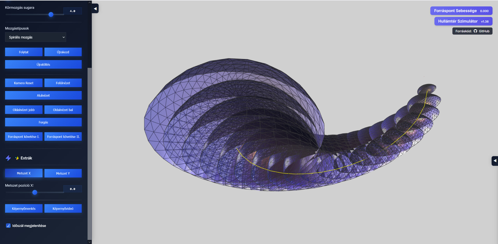
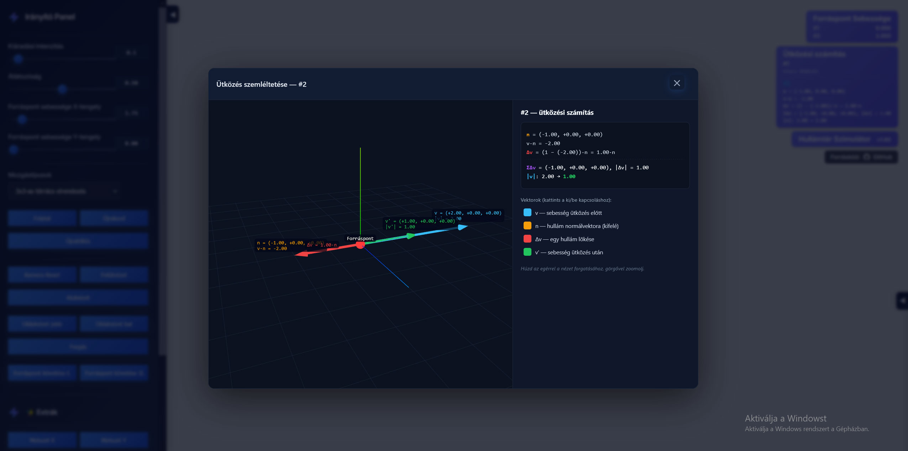

# 3D Hullámtér Szimulátor

Egy interaktív 3D hullámtér szimuláció, amelyet a Three.js könyvtár segítségével készítettem. A program lehetővé teszi egy forráspont gömbszerűen kibocsájtott hullámai terjedésének a megfigyelését a forráspont különböző típusú mozgásai közben a 3D térben.




## Újdonságok az 1.60-as verzióban (az 1.59-es verzióhoz képest)

**Kattintható 3D ütközés-szemléltető**:
- A panelen a forráspont sorszáma (pl. **#1**, **#2**) mostantól **kattintható** — rákattintva felugró ablak nyílik.
- A felugró ablak egy interaktív **3D szemléltetést** mutat, amelyben színkódolt irányvektorok jelenítik meg az ütközés geometriáját: a sebességvektor ütközés előtt (**v**), minden hullám normálvektora (**n**), az egyes hullámok lökései (**Δv**), az összesített lökés (**ΣΔv**) és az eredő sebesség (**v'**).
- A vektorok mellett a számértékek is megjelennek, az oldalsó panel pedig a teljes egyenletet és egy színmagyarázatot tartalmaz.
- A nézet **egérrel forgatható** és **görgővel zoomolható**; az ablak az **Esc** billentyűvel vagy a háttérre kattintva zárható.
- A szemléltető kódja külön fájlban található (`collision_viz.js`), hogy a fő programkód ne hízzon feleslegesen.

**Ki-/bekapcsolható vektornyilak a 3D ütközés-szemléltetőben**:
- A felugró 3D szemléltető oldalsó paneljén a színmagyarázat (legenda) elemei mostantól **kattinthatók** — a színikonra (vagy a sor szövegére) kattintva az adott típusú vektornyíl **ki- vagy bekapcsolható**.
- Ez akkor hasznos, ha több vektor egymást takarja: a nem kívánt vektorok kikapcsolásával **jól elkülönítve** vizsgálhatók a megmaradó nyilak (pl. csak a normálvektorok, vagy csak a sebességvektorok).
- A kikapcsolt vektor a 3D nézetből és a hozzá tartozó számérték-címke is eltűnik; a legendában az elem áthúzott és halványított lesz.
- **Alapból minden vektor be van kapcsolva**, ahogy eddig is. Az ablak újranyitásakor az állapot visszaáll alaphelyzetbe.



## Újdonságok az 1.59-es verzióban (az 1.58-as verzióhoz képest)

**Ütközési számítás panel**:
- Új panel a jobb felső sarokban (a „Forráspont Sebessége” panel alatt), amely **minden aktív forráspontnál** megjeleníti a legutóbbi hullámfelülettel való ütközés teljes vektoregyenletét.
- A panel valós időben mutatja a normálvektort (`n`), a radiális sebességkomponenst (`v·n`), a lökésszámítást (`Δv`), az összesített lökésvektort (`ΣΔv`) és a sebesség változását (`|v|: előtte → utána`).
- Az utolsó ütközés adatai a képernyőn maradnak, amíg egy újabb ütközés nem váltja fel őket.
- A megjelenő egyenletek értelmezéséhez részletes, általános segédlet készült (lásd lentebb a **„A vektoregyenletek értelmezése”** szakaszt).

### A vektoregyenletek értelmezése

A jobb felső sarokban megjelenő **Ütközési számítás** panel azt mutatja, hogy amikor a forráspont egy kiáradó hullámgömb felszínébe ütközik, a program milyen vektorszámítással dönti el, mennyire változik meg a forráspont sebessége. A panel minden aktív forráspontnál külön megjeleníti a legutóbbi ütközés számítási adatait. A program kiszámítja, hogy ez a nyomás milyen irányba és mekkora lökést ad a forráspontnak.

**A sorok jelentése általánosan:**

A panelen minden forráspontnál egy blokk jelenik meg, amelynek sorai ugyanazt a logikát követik:

```
#1 (2 hullám)
n = (x, y, z)
v·n = érték
Δv = (1 − érték)·n = eredmény·n
ΣΔv = (X, Y, Z),  |Δv| = nagyság
|v|: sebesség_előtte → sebesség_utána
```

**A sorok jelentése általánosan:**

**#1 (N hullám)**
- **#1** = a forráspont sorszáma (ugyanúgy számozva, mint a sebesség panelen).
- **(N hullám)** = hány különböző hullámgömb felszíne éri el egyszerre a forráspontot. Ha nincs zárójelben szám, akkor csak 1 hullám hat.

**n = (x, y, z)**
- **n** = a hullámgömb középpontjából a forráspont felé mutató egységvektor (a felszín "normálisa").
- Ez megadja a lökés irányát: mindig a gömb középpontjából **kifelé** mutat. Ha például a gömb a forrásponttól jobbra van, akkor a lökés balra tolja el a forráspontot.
- Az értékek -1 és +1 között vannak, és a tér három irányát (X, Y, Z) írják le.

**v·n = érték**
- Ez a **pontszorzat**: a forráspont sebességvektorának (v) vetülete az n irányra.
- Az érték megmondja, hogy a forráspont milyen gyorsan mozog a hullámfelület irányába vagy annak ellenkező irányába.
- A számok ún. "fizikai egységben" vannak, ahol **1.00 = a hullám tágulási sebessége**.

| v·n értéke | Mit jelent? |
|-----------|-------------|
| **Negatív** (pl. -0.50, -1.00) | A forráspont **befelé** mozog a hullámfelület irányába (szembe a tágulással). Minél kisebb (negatívabb), annál gyorsabban ütközik befelé. |
| **Nulla** (0.00) | A forráspont **áll** (radiálisan nem mozog a gömbhöz képest). A hullám teljes erejével megtolja. |
| **Pozitív, de < 1** (pl. +0.30) | A forráspont **kifelé** mozog, de lassabban, mint a hullám tágul. A hullám még utoléri és megtolja. |
| **≥ 1** (pl. +1.20) | A forráspont **gyorsabban mozog kifelé**, mint a hullám tágul. A hullám nem éri utol, **nincs hatás**. |

**Δv = (1 − v·n)·n = eredmény·n**
- Ez a **lökés nagysága** egyetlen hullámtól.
- A képlet: `Δv = (hullámsebesség − radiális sebesség)`.
- Ha a forráspont befelé megy (negatív v·n), a két érték összeadódik, így nagyobb lökés keletkezik.
- A program a "folytonos cap szabályt" használja: a lökés nagysága soha nem haladhatja meg a hullám tágulási sebességét (1.00 egység).
- Az **n** szorzó azt jelenti, hogy a lökés mindig a gömb középpontjából **kifelé** mutat.

**ΣΔv = (X, Y, Z), |Δv| = nagyság**
- **ΣΔv** = az **összesített lökésvektor**. Ha egyszerre több hullám is éri a forráspontot, a program minden hullámtól kapott lökést **vektoriálisan összegzi** (nem csak egyszerűen összeadja a számokat!).
- Az összegzés figyelembe veszi az irányokat is: ha két szembenálló hullám egyszerre éri el a pontot, a lökéseik kioltják egymást.
- **|Δv|** = a lökésvektor hossza (nagysága). Ez mutatja meg, hogy összességében mekkora lökést kapott a forráspont.

**|v|: sebesség_előtte → sebesség_utána**
- A forráspont **teljes sebességének nagysága** az ütközés előtt és után.
- A program a radiális (gömb középpontja felé/kifelé) sebességkomponenst módosítja, de a **tangenciális** (oldalirányú) mozgást meghagyja.
- Ezért előfordulhat, hogy a teljes sebesség csökken, de nem nullázódik ki — a forráspont továbbra is oldalirányban mozoghat.


**Gyors referencia:**

| Jelölés | Jelentése | Fontos tudnivaló |
|---------|-----------|------------------|
| **n** | Normálvektor (kifelé mutat a gömb középpontjából) | Megadja a lökés irányát |
| **v·n** | Radiális sebességkomponens | Negatív = befelé, pozitív = kifelé, 0 = álló |
| **Δv** | Egy hullámtól kapott lökés | Nagysága maximum 1.00 (hullámsebesség) |
| **ΣΔv** | Összesített lökésvektor | Több hullám esetén vektoriális összeg |
| **\|Δv\|** | A lökés nagysága (skalár) | Soha nem lehet nagyobb 1.00-nál |
| **\|v\|** | A forráspont teljes sebessége | Csak a radiális komponens változik meg |


## Újdonságok az 1.58-as verzióban (az 1.57-es verzióhoz képest)

**Körmozgás sebesség mód (Egyenletes / Lassuló)**:
- A tűzelemhez hasonló rádiógomb-pár jelenik meg a **Körmozgás** mozgástípus kiválasztásakor.
- **Egyenletes**: a forráspont a csúszkán beállított szögsebességgel egyenletesen mozog a körpályán (korábbi viselkedés).
- **Lassuló**: a forráspont a beállított sebességgel indul, és minden új kiáradásnál **2 / körsugár egységgel csökkenti a szögsebességét**, amíg le nem áll.
- A lassulás matematikailag úgy van meghatározva, hogy a kialakuló **körívek egy idő után pontosan érintsék egymást** (ugyanaz a geometriai elv, mint a tűzelem lassuló módjánál). A lépés a körsugárhoz igazodik, így a feltétel minden sugárértéknél érvényes marad.
- A csúszka értékének módosításakor és jelenetújraindításkor a lassuló sebesség automatikusan visszaáll a kezdeti értékre.

**Videórögzítés felbontásának stabilizálása**:
- Javítva, hogy sok objektum (hullámgömb) megjelenítésekor a videó **ne essen vissza alacsony felbontásra**.
- A rögzítés alatt a composite canvas elem **nem cserélődik le** (a `captureStream()` az eredeti elemhez kötött marad), így nem szakad meg a folyam.
- A rögzítési felbontás **QHD-re (max. 2560×1440) korlátozott**, hogy a VP9 enkóder ne skálázzon le dinamikusan terhelés alatt.
- A MediaRecorder bitráta **8 Mbps-ről 25 Mbps-re emelve**, így a kép végig éles marad sűrű jelenetnél is.

**Maximálisan megjeleníthető gömbök számának emelése**:
- Az egyszerre megtartott hullámgömbök felső határa **400-ról 3000-re nőtt**, így hosszabb, sűrűbb hullámterek figyelhetők meg a legrégebbi gömbök törlése előtt.

**Forráspont Sebessége panel javítása**:
- A több forráspontot használó módoknál (**3x3-as térrács**, **tetraéder csúcspontjai**, **15 forráspont**) a panel korábban eggyel több forráspontot listázott (egy plusz, 0 értékű elemmel).
- A javítás kihagyja a rejtett, nem használt központi forráspontot, így a lista mostantól **pontosan a tényleges aktív forráspontok számát és sebességét** mutatja, helyes sorszámozással.

## Újdonságok az 1.57-es verzióban (az 1.56-os verzióhoz képest)

**Tűzelem sebesség mód (Egyenletes / Lassuló)**:
- Új rádiógomb-pár jelenik meg a tűzelem mozgástípus kiválasztásakor a forráspont sebességcsúszkái alatt.
- **Egyenletes**: a forráspont a csúszkán beállított sebességgel egyenletesen mozog (korábbi viselkedés).
- **Lassuló**: a forráspont a beállított sebességgel indul, és minden egyes új kiáradás indításakor **2 egységgel csökkenti a sebességét**, amíg el nem éri a 0-t.
- A lassulás matematikailag úgy van meghatározva, hogy a leálláskor az összes kiáradó gömbfelület **pontosan érinti egymást** (nem hatolnak egymásba, nincsenek köztük hézagok). Például 6-os kezdeti sebesség esetén a forráspont 3 kiáradást bocsát ki (d₀=4, d₁=2, d₂=0), és a gömbfelületek t=2,5 kiáradási intervallumonként érintik egymást.
- A csúszka értékének módosításakor és jelenetújraindításkor a lassulás automatikusan visszaáll a kezdeti értékre.

**Forráspont sebesség csúszka tartományának bővítése**:
- A forrássebesség X és Y csúszkák maximuma **6-ról 20-ra nőtt**, lehetővé téve nagyobb távolságú tűzelem mozgások szimulálását.

**Metszősík forgatás**:
- Új gombok az X és Y metszősíkok 45°-os lépésekben történő forgatásához.
- A forgató gombok csak akkor jelennek meg, ha az adott metszősík aktív.
- A normálvektor forgatása a csúszkás pozícióbeállítással kombinálható.

**Navigációs léptetés felbontása**:
- Új rádiógomb-csoport az „Időszál megjelenítése" jelölőnégyzet felett.
- **Normál**: eredeti kamera- és objektumnavigációs érzékenység.
- **Közepes**: 2× finomabb navigáció (eger, görgő, billentyűzet, kameraforgatás).
- **Kicsi**: 4× finomabb navigáció — hasznos, ha a kamera nagyon közel van egy objektumhoz és kis lépésekben kell mozogni.

**Képernyőmentés és videórögzítés — sebesség panel beleégetése**:
- A mentett képernyőkép és a rögzített videó mostantól tartalmazza a jobb felső sarokban megjelenő **„Forráspont Sebessége"** panelt (az összes aktív emitter aktuális sebességével).
- A composite canvas technológia a Three.js WebGL canvast és a panel szövegét egy 2D canvasra rajzolja össze.

**Videórögzítés felbontás- és minőségjavítás**:
- A renderer mostantól `preserveDrawingBuffer: true` opcióval és `setPixelRatio(window.devicePixelRatio)` hívással indul, így HiDPI és Windows-skálázásos (pl. 125%) kijelzőkön is **fizikai pixelfelbontáson** rögzít.
- A composite canvas mérete `window.innerWidth × devicePixelRatio` × `window.innerHeight × devicePixelRatio` (pl. 1920×1080 125%-os skálázásnál, szemben a korábbi 1536×864-gyel).
- A MediaRecorder bitráta explicit **8 Mbps**-re van állítva a jobb tömörítési minőség érdekében.
- Ablakméret-változáskor a composite canvas automatikusan újraméreteződik.

## Újdonságok az 1.56-os verzióban (az 1.54-es verzióhoz képest)

**15 forráspont tetszőleges beállítási lehetősége**:
- Új mozgástípus a legördülő menüben: „15 forráspont tetszőleges beállítási lehetősége".
- Felugró konfigurációs modál 15 forráspont egyedi beállításához:
  - Minden pont aktiválható/deaktiválható egyenként.
  - Pozíció (X, Y, Z) tetszőlegesen megadható.
  - Szerepkör: vízelem (álló, kék) vagy tűzelem (mozgó, piros).
  - Tűzelem esetén sebesség és irányvektor beállítható.
- Alapértelmezett pozíciók Fibonacci-gömb elrendezéssel, sugár = 2.
- Tűzelem irányvektor automatikusan az origó felé mutat alapértelmezetten.

**Preset (beállítás-csomag) kezelés**:
- Konfigurációk mentése, betöltése és törlése név alapján (localStorage).
- A mentett presetek böngésző-szinten megmaradnak az újraindítások között.

**Exportálás / Importálás fájlba**:
- Az aktuális konfiguráció letölthető JSON fájlként (⬇ Exportálás gomb).
- Korábban mentett vagy mástól kapott konfiguráció betölthető fájlból (⬆ Importálás gomb).
- A fájlformátum: `wave3d_free15` JSON, pontosan 15 sor adataival.
- Importáláskor teljes validálás: formátum, sorok száma, mezőtípusok ellenőrzése.
- Elfogadott kiterjesztések: `.json`, `.wave15`.

**Színtér-tisztítás free15 módváltáskor**:
- A „15 forráspont tetszőleges beállítási lehetősége" kiválasztásakor a korábbi szimuláció teljes mértékben törlődik (hullámgömbök, időszál, másodlagos forráspont).
- A beállító modál megnyitásakor az animációs ciklus kibocsátása leáll — a 3D színtér tisztán várja az új konfigurációt.

**Képernyő- és videómentés javítások**:
- A képernyőmentés és videórögzítés gombok megjelenítése visszaállítva.
- A videómentés felbontása megnövelve a jobb minőségű felvétel érdekében.

## Újdonságok az 1.54-es verzióban (az 1.5-ös verzióhoz képest)

**Per-emitter, per-sphere ütközési állapotkezelés**:
- A korábbi modell egyetlen `hasReducedSpeed` flag-et tárolt gömbönként, és ezt a gömb tulajdonosának pozíciója alapján resetelte minden frame-ben. Ez hibás volt több forráspont esetén: ha pl. Fire B kibocsájtott egy hullámot, majd elindult más irányba, a flag minden frame-ben resetelődött, és a hullámba belépő Fire A-t a hullám folyamatosan tolta maga előtt, ahelyett, hogy egyetlen impulzussal lassította volna.
- Mostantól minden gömb `Map<emitter, state>` szerkezetben tárolja az egyes forráspontokra vonatkozó állapotot (`hasLeftSource`, `canPushSource`, `hasReducedSpeed`, `hasPenetrated`). Az `updateSpheres()` minden aktív emitterre külön frissíti a saját állapotát, így egy adott forráspont csak akkor kap újra impulzust egy gömbtől, ha **ő maga** lépett ki és lépett vissza.
- Eredmény: a 3×3-as rácsban több tűzelem és vízelem keresztezése is fizikailag korrekt — egy hullám pontosan egy impulzust ad le egy adott forráspontra a behatolási epizód során.

**Folytonos Δv-szabály a határponton**:
- Az 1.5-ös verzióban diszkontinuitás volt a Δv képletében pontosan `v_r = −waveSpeed`-nél (a B1/B2 ágak váltása). Ez floating-point szempontból instabil volt: minden cancellation pontosan ezen a határponton zajlott le, és a numerikus zaj felváltva a helyes (`v=0`) vagy hibás (`v` megfordul az álló forrás felé) ágat választotta.
- Az új, **folytonos cap szabály**: `Δv = min(waveSpeed, waveSpeed − v_r)`. Egyetlen képlet, nincs ágválasztás `v_r < 0` esetén — ott mindig pontosan `waveSpeed` az impulzus.
- Eredmény: szembefutó hullámok (egyik forrás `+1` push, másik `−1` push) **minden esetben stabilan kioltják egymást**, a forrás 0-nál marad, nem flickerel ki-be.
- Az 1.5-ös spec konkrét példái változatlanok (`v_r = 0 → +1`, `v_r = −2 → −1`, `v_r = +0.8 → +1`). Az egyetlen különbség a `v_r ∈ (−1, 0)` átmeneti tartományban van, ahol most a hullám 1 egységgel csökkenti a befelé sebességet ahelyett, hogy a saját sebességére rántaná a forrást — ez teszi a szabályt folytonossá.

**Azonnali első kibocsájtás indításkor**:
- Korábban a szimuláció elindításakor (vízelem, tűzelem, körmozgás, spirál, 3×3 rács) a forráspont egy teljes kibocsájtási intervallumot várt az első hullám előtt, így a tűzelem már megtett egy darab utat, mire az első hullámát létrehozta.
- A `WaveEmitter` konstruktorban és a `resync()`-ben a `lastEmissionTime` mostantól `-Infinity`-re inicializálódik, így az **első frame-ben azonnal** kibocsájtódik a hullám a forráspont kezdeti pozíciójában. A reset (Újrakezd) gomb után is helyesen indul.

## Újdonságok az 1.5-ös verzióban (az 1.43-as verzióhoz képest)

**Egységesített Δv-impulzus ütközésmodell**:
A korábbi, négy külön ágra (befelé mozgás / álló / lassan kifelé / gyorsan kifelé) bontott ütközéslogikát egyetlen, fizikailag konzisztens szabály váltotta fel. Minden átfedő hullámfelületre a forráspont radiális sebességkomponense (`v_r = v · r̂`) alapján számolódik az impulzus:

- Ha `v_r ≥ 1` (forráspont belülről kifelé előzi a felületet) → **nincs hatás**, a hullám áthalad.
- Egyébként → `Δv = (1 − v_r) · r̂` impulzus hozzáadódik az eredőhöz.

Az összes egyidejűleg átfedő gömbtől kapott `Δv_i`-t a program **vektoriálisan összegzi** és **hozzáadja** (nem felülírja) a forráspont sebességéhez. Ez automatikusan kezeli:

- a szimmetrikus szembehullámok kioltását (forráspont egy helyben marad, hullámok áthaladnak),
- az egyidejűleg több irányból érkező hullámok eredő hatását (akár 1-nél nagyobb eredő sebesség is kialakulhat),
- a forráspont tangenciális mozgásának megőrzését (pl. fire módban a felhasználó által beállított oldalirányú sebesség nem törlődik ki az ütközéseknél),
- minden egyes új hullámfelülettel való találkozás külön elszámolását (a `hasReducedSpeed` flag csak addig blokkol, amíg a forráspont a gömbön belül van, kilépés után automatikusan reset).

**Egyéb javítások**:
- A `radialOutward` normalizálás biztonságos numerikus kezelése (forráspont a gömb középpontján → epizód kihagyva NaN helyett).
- A korábbi „nagy sebességű kifelé áthatolás 1 egység sebességcsökkenéssel" ág megszüntetve — már nem volt összhangban a fizikai modellel.
- A taszítás és az áthatolás többé nem zárja ki egymást ugyanabban a frame-ben: minden hullám hozzájárul az eredőhöz.

## Újdonságok az 1.43-as verzióban (az 1.42-es verzióhoz képest)

**Ütközésmodell további finomítása**:
- Ha a forráspont **befelé mozog** (szembe a hullámmal), mindig sebességcsökkenés történik
- Ha a forráspont **áll** vagy **kifelé mozog** lassabban mint a hullám, akkor taszítás történik
- Ez megoldja azt a problémát, hogy a befelé mozgó forráspont a második rétegnél megáll (2→1→0), nem pedig visszapattan

## Újdonságok az 1.42-es verzióban (az 1.41-es verzióhoz képest)

**Ütközésmodell javítása**:
- Az összes ütköző hullám hatását vektoriálisan összegzi
- Ha ellentétes irányú hullámok érik el a forráspontot, a hatásuk kioltja egymást
- A taszítás mindig működik, függetlenül attól, hogy a hullám korábban áthaladt-e a forráspontot
- Javított Újrakezd gomb működés a 3x3-as térrács módban

## Újdonságok az 1.41-es verzióban (az 1.40-es verzióhoz képest)

**Vízelem és Tűzelem forráspontok a 3x3-as térrácsban**:
- Háromállapotú kiválasztás: szürke → sárga → piros → szürke
- **Sárga (vízelem)**: álló forráspont, helyben marad és kiárad
- **Piros (tűzelem)**: mozgó forráspont, 2-es sebességgel halad a térrács középpontja felé
- Részletes kijelzés a kiválasztott pontok számáról (vízelem/tűzelem bontásban)
- A vízelem forráspontok kék színnel, a tűzelem forráspontok piros színnel jelennek meg

## Újdonságok az 1.40-es verzióban (az 1.39-es verzióhoz képest)

**3x3-as térrács elrendezés mód**:
- Új mozgástípus: "3x3-as térrács elrendezés" a Vízelem után.
- 27 pontos (3×3×3) kockaháló megjelenítése a 3D térben.
- Interaktív pont kiválasztás: kattintással sötétszürkéről sárgára váltanak a pontok.
- Felugró információs panel a kiválasztási folyamat leírásával.
- Indítás gomb a szimuláció elindításához a kiválasztott pontokkal.
- A kiválasztott pontokban piros forráspontok jelennek meg, amelyek egyszerre kezdenek kiáradni.
- A szimuláció indítása után a forráspontok reagálnak az ütközésmodellre.

## Újdonságok az 1.39-es verzióban (az 1.38-as verzióhoz képest)

**Pause szinkronizáció javítása**:
- A pause (szünet) funkció most már helyesen kezeli a kiáradási ütemezést.
- Pause után az új kiáradások szinkronban maradnak a régiekkel.
- A pause alatt eltelt idő nem számít bele a kiáradási intervallumba.
- A rétegtávolságok egyenletesek maradnak a pause előtt és után is.

## Újdonságok az 1.38-as verzióban (az 1.37-es verzióhoz képest)

**Információs panel átalakítása oldalpanellé**:
- Az Információs panel (irányítási útmutató) Ki-be görgethető átalakítása.
- Ütközés modell finomítása

## Újdonságok az 1.37-es verzióban (az 1.36-os verzióhoz képest)

**Irányító panel átalakítása oldalpanellé**:
- Ütközés modell finomítása
- Az Irányító panel mostantól a képernyő bal oldalán helyezkedik el teljes magasságban, oldalpanelként.
- Ki-be görgethető a panel tetején található nyíl gombbal (◀/▶).
- Az EXTRÁK panel tartalma bekerült az Irányító panel aljára, külön szekcióként.
- Ha a panel tartalma hosszabb mint a képernyő magassága, görgetni lehet a panelt.
- Egyedi scrollbar stílus a panelhez.
- A panel állapota (nyitott/zárt) megőrződik az oldal frissítésekor.

## Újdonságok az 1.36-os verzióban (az 1.35-es verzióhoz képest)

**Időszál vonal leképzése**:

- Az időszál vonal leképzése most már elérhető a "Időszál megjelenítése" jelölőnégyzet bekapcsolásával.
- Új billentyűk: ő,ú,á,ű a jelenet forgarása közvetlenül a billentyűzettel. Ez aehetőség videórögzítés esetén hasznos lehet, mert zökkenőmentesebb videók készítése lehetséges.

## Újdonságok az 1.35-ös verzióban (az 1.34-es verzióhoz képest)

**Képernyő videó felvétele (WebM formátumban)**:

- A képernyő videó felvétele most már elérhető a "Képernyővideó" gombbal.
- A progam indításkor ellenőrzi a különböző formátumok támogatottságát a következő sorrendben:
video/webm;codecs=vp9 (legjobb minőség)
video/webm;codecs=vp8 (széles körben támogatott)
video/webm (alap WebM)
video/mp4 (széles körben támogatott)
Az első támogatott formátumot fogja használni a felvételhez.
Ez biztosítja, hogy a képernyőfelvétel funkció a legtöbb modern böngészőben működjön.
- A felvétel leállításakor automatikusan letölti a videót a böngészőben WebM formátumban  mert ez minden böngészőben támogatott. Ezt a formátumot a windows media player támogatja, de nagon egyszerűen átalakítható MP4 formátumba is például a ingyenesen a https://www.freeconvert.com/webm-to-mp4 oldal segítségével.
- A legjobb minőségű videófelvétel érdekében a következő paramétereket használja a program a rögzítéskor: 
 60 FPS a felvétel képkockasebessége és 8 Mbps-re állítva a videó bitrátája.
 

## Újdonságok az 1.34-es verzióban (az 1.32-es verzióhoz képest)

### Új funkciók és működési módok

- **Két forráspont kiáradási mód (1 mozgatható, 1 fix)**: Most már két forráspont is megjeleníthető egyszerre, amelyek egymástól függetlenül bocsájtanak ki gömbhullámokat.

- **Hullámok és forráspontok interakciójának fejlesztett kezelése**:
  - A forráspontra (piros gömb) csak azok a kiáradó hullámok hatnak, amelyek már teljesen elhagyták a kibocsátó forráspontot.
  - Új interakciós mechanizmus, amely megakadályozza, hogy a hullámtér azonnal visszahasson a forrásra.
  - Beépített taszítási mechanizmus, amely a kiáradó hullámtér és a forráspontok találkozásához kötődik, irányvektor szerinti taszítás.

- **Gömbök élettartamának és mennyiségének optimalizált kezelése**:
  - A rendszer maximum 200 gömböt tart meg, a lerégebbiek automatikusan törlődnek.

### Technikai fejlesztések

- **Hatékony háromdimenziós térben történő ütközésdetektálás I. fázis**: Javult az ütközések és kölcsönhatások precizitása a Three.js vektoraritmetikájának fejlesztett használatával (de még csak a taszító hatásokhoz).

- **Pozíció klónozási probléma javítása**: Minden gömb számára egyedi Vector3 objektum külön létrehozásra kerül, biztosítva, hogy az emitterek egymástól függetlenül működjenek.

- **Kódszerkezeti és hatóköri javítások**: A rendszer komponenseinek globális elérhetőségét újrastruktúráltuk, biztosítva a konzisztens működést.

- **Új billentyű funkciók**:
  - P: Szünet/Folytatás


## Főbb jellemzők

- **Különböző mozgástípusok**:
  - Vízelem (nincsen mozgás)
  - Tűzelem (vízszintes mozgás)
  - Körmozgás (körkörös mozgás)
  - Spirális mozgás (körkörös + emelkedő mozgás)

- **Testreszabható paraméterek**:
  - Forrás sebessége (X és Y irányban)
  - Gömbök átlátszósága (0 = teljesen átlátszatlan, 1 = csak drótváz)
  - Kiáradási intenzitás

- **Fejlett kamerakezelés**:
  - Több előre beállított nézet (felülnézet, alulnézet, oldalnézet)
  - Forráspont automatikus követése (két különböző módon)
  - Kamera forgatás funkció
  - Billentyűzetes navigáció (W/A/S/D és nyilak)
  - Színtér forgatása X és Y tengely körül (X és Y billentyűk)

- **Metszési funkciók**:
  - X és Y irányú metszősíkok
  - Állítható metszési pozíciók
  - A belső struktúrák vizsgálatához

- **Extra funkciók**:
  - Képernyőmentés funkció (JPG formátumban)
  - Szünet/folytatás vezérlés
  - Jelenet újraindítás

- **Felhasználóbarát kezelőfelület**:
  - Összecsukható vezérlőpanelek
  - Részletes útmutató
  - Reszponzív design
  - Modern, minimalista felület

## Telepítés és futtatás

1. Klónozd le a repository-t:
   ```
   git clone https://github.com/TTomas65/3D-Hullamter-Szimulator.git
   ```

2. Nyisd meg a `sphere_emitter_3d.html` fájlt egy modern webböngészőben (Chrome, Firefox, Edge ajánlott).

## Használat

1. A bal felső sarokban található Irányító panelen állíthatod be a fő paramétereket.
2. Az Extrák panelen találhatók a metszési és képernyőmentési funkciók.
3. Az egérrel mozgathatod a kiáradási pontot (bal gomb) és forgathatod a nézetet (jobb gomb).
4. A billentyűzettel navigálhatsz a térben (W/A/S/D és nyilak).
5. Az egérgörgővel közelíthetsz vagy távolíthatsz.
6. A jobb alsó sarokban található útmutató részletes információkat ad a kezelésről.

## Irányítás

- **Egér**:
  - Bal egérgomb: Kiáradási pont mozgatása
  - Jobb egérgomb: Kamera forgatása (orbit)
  - Egérgörgő: Nagyítás / kicsinyítés

- **Billentyűk**:
  - W / S: Előre / Hátra
  - A / D vagy ◀ / ▶: Balra / Jobbra
  - ▲ / ▼: Felfelé / Lefelé
  - X: Színtér forgatása X tengely körül (amíg nyomva tartod)
  - Z: Színtér forgatása Y tengely körül (amíg nyomva tartod)
  - P: Szünet / Folytatás

## Követelmények

- Modern webböngésző (HTML5 és WebGL támogatással)
- Internetkapcsolat (a Three.js betöltéséhez)

## Licenc

Ez a projekt nyílt forráskódú, a [MIT licenc](LICENSE) alatt érhető el.

## Fejlesztői információk

Köszönöm, hogy a Hullámtér Szimulátort használod! Ha bármilyen kérdésed vagy javaslatod van, ne habozz megnyitni egy új issue-t a GitHub-on.
